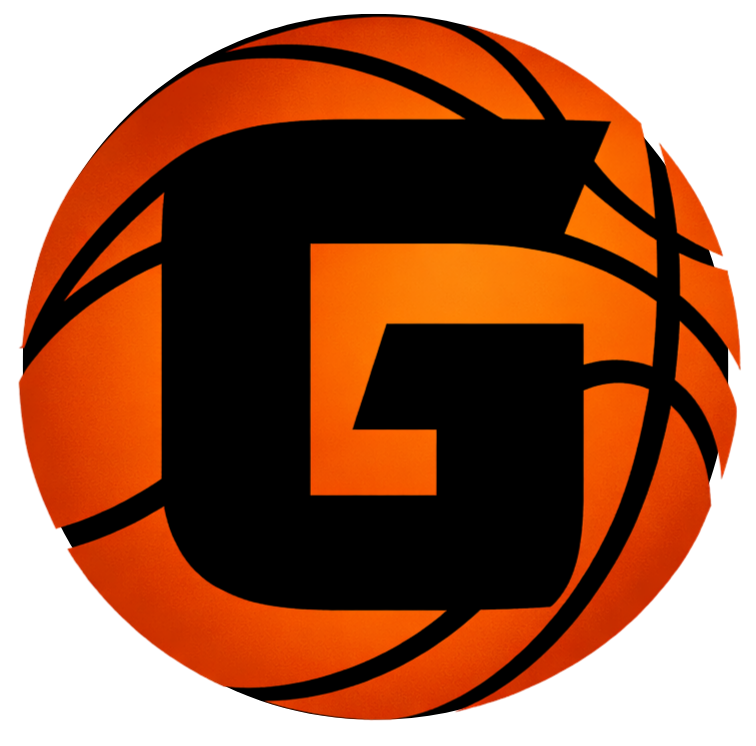

<p align="center">
  
</p>

<h1 align="center">Giddey</h1>

<p align="center">
  <strong>A daily basketball draft puzzle game.</strong><br/>
  Draft 9 players. Build chemistry. Score big.
</p>

<p align="center">
  <a href="https://playgiddey.com">Play Now</a>
</p>

---

## What is Giddey?

Giddey is a browser-based puzzle game inspired by **2K MyTeam** and formation puzzles like Griddy. Each game is a 9-round draft where you're dealt 3 random NBA player cards per round and must pick one to place on a court-shaped grid.

The catch: you can't undo a pick, and your score depends on both the **talent** of the players you draft and the **chemistry** between them on the grid.

Your goal is to maximize your total score out of **279**.

## How Scoring Works

**Talent** — Higher-rated cards earn more points. Cards range from Gold (76 OVR, +1 pt) to Dark Matter (100 OVR, +15 pts). Max talent across 9 cards is 135.

**Chemistry** — Adjacent players on the grid earn chemistry bonuses when they share a **team**, **division**, or **draft year**. Strong connections light up green lines and green dots for big bonus points. Max chemistry is 144.

## The Grid

Your 9 players are arranged in a diamond formation with 15 connections between them:

```
        [SG]    [PF]
  [UTIL] [PG]  [PG] [UTIL]
  [SF]              [SG]
           [C]
```

The **Center** slot is the most connected position on the board (4 neighbors), making it the most important pick. **UTIL** slots accept any position. You can drag cards around to rearrange at any time.

## Features

- **9 card tiers** from Gold to Dark Matter, each with unique 2K-style card art, shimmer effects, and star ratings
- **235+ NBA players** with real headshots, teams, divisions, and draft years
- **Custom hero cards** like Hoodie Melo (Dark Matter, 100 OVR, Knicks)
- **Drag-and-drop** card placement and rearranging (works on mobile too)
- **Optimal lineup solver** that shows the best possible arrangement after you submit
- **Draft odds** that shift each round — early picks have better chances at elite tiers
- **PWA ready** — add to your home screen for a native app feel

## Tech Stack

- Next.js 16 (App Router) / React 19 / TypeScript / Tailwind CSS 4
- No backend or database — fully client-side with bundled player data

## Running Locally

```bash
cd giddey-app
npm install
npm run dev
```

## License

ISC
